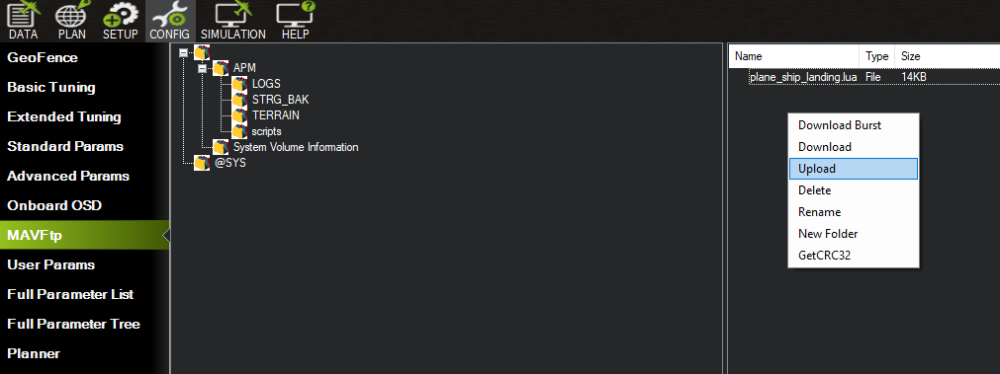
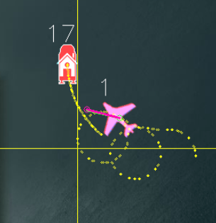
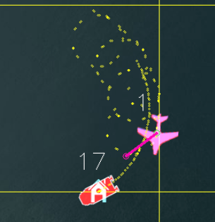
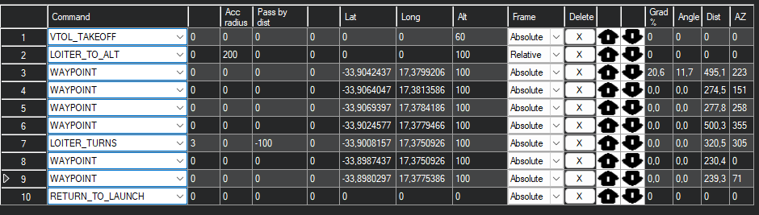

# Boat Landing

The 3D Tactical System tracker is engineered for use in harsh and demanding environments. Beyond its durable construction, it incorporates features enabling operation on moving or floating platforms. To execute a flight mission under such conditions, two primary challenges must be addressed:

The home (RTL location) must be dynamically updated to reflect the ground control station or platform's position, ensuring the UAV can always return and land successfully without pilot intervention.
The UAV must be capable of taking off, approaching, and landing on a platform with limited space, while navigating around superstructures and other obstacles.
This document outlines the strategies and preparations necessary to undertake such a mission. 

note! The Boat Landing functionality is suported for Quad-Plane (VTOL) UAV's only


## Equipment Setup

In addition to the instructions detailed in Setup, the following considerations should be taken into account:

* The base of the antenna tracker should be oriented towards the front of the moving platform. Careful note of the orientation and position should be documented before flight.
* The Home Location is fixed relative to the position and orientation of the antenna tracker. This means that if the antenna tracker is rotated by 15 degrees, the Home Location will adjust accordingly.
* If the base of the antenna tracker is disturbed during a flight, it should be realigned to its original position and orientation before an RTL (Return to Launch) mode is activated.


 


## Enabling Scipting on the Flight Controller

To enable the boat landing functionality, an additional script must be incorporated into the flight controller. By default, scripting is disabled on the flight controller. To activate this feature, the following parameters will need to be modified: 

1) Enable Scripting: Set the SCR_ENABLE parameter that enables the execution of custom scripts.
2) Memory Allocation for Scripts: Increase the memory allocated for the script.
3) Enable MAVftp: Enable MAVftp functionality to be able to upload the required script to the flight controller.

|    Parameter       | Value            | Description                                           |
| -------------      |:-------------    | :-----                                                |
| SCR_ENABLE         | 1                | Enable Lua sripting on the flight controller          |
| SCR_HEAP_SIZE      | 100000           | Provide enough memory to allow the script to run      |
| BRD_OPTIONS        | 1                | Enable MAVftp     |


note! Remember, after changing these parameters, it's important to save your settings and possibly restart the flight controller for the changes to take effect.


Dowload the ship landing script from [here](uploads/documents/plane_ship_landing.lua) and upload it to the 'scripts' file on the SD card of the flight controller. MAVFtp through Mission Planner can be used for the file transfer. The flight controller will need a reboot to run the script. 




## Ship Landing Function

The ship landing script only effects the *AUTO*, *RTL* and *Q_RTL* flight modes. There is no behaviour change applied to *QLOITER*, *QHOVER*, *FBWA*, *FBWB*, *CRUISE* ex.

### Take-Off
During an *Auto* take-off, while in Quad-mode, the  UAV will match the velocity of the moving base until the transition altitude. This will ensure the UAV follows a 'vertical' path relative to the moving platfrom to avoid any platfrom superstructure.

### RTL

The Return to Launch (RTL) feature is under pilot control. When an RC (Remote Control) connection is active, the pilot has the capability to adjust certain aspects of the UAV's landing process. This includes managing the timing of the RTL stages, allowing the pilot to "pause" the RTL at any stage until conditions are deemed suitable to proceed. Moreover, the RTL process can be terminated at any stage, with the option to revert to the preceding stage if necessary. This level of control ensures that the pilot can respond dynamically to changing conditions, enhancing the safety and flexibility of the landing operation.

If an RC connection is not established the UAV will transition through each stage automatically without delay. 

 The RTL function is performed in four stages.


 1) **Return Home -** Once the RTL is initiated, the UAV ascends to the **ALT_HOLD_RTL** and begins its return to the Home Location.
2) **Hold-off Position -** When the UAV reaches a distance of about 2 x the **RTL_RADIUS** from the Home Location, it will enter the hold-off position stage. The UAV will circle/loiter in close proximity to the moving platform, maintaining a **ALT_HOLD_RTL** altitude. Upon input from the pilot, the UAV will begin the Platform Approach stage.
3) **Platform Approach -** The UAV will continue loitering but descend down to an altitude set by **Q_RTL_ALT**. Upon input from the pilot, the UAV will begin the Q-Land stage.
4) **Q-Land -** The UAV will approach the platform at an angle defined by **SHIP_LAND_ANGLE**. It will transition to Q-RTL and begin a final descent to the platform. The UAV will continue to match the platform velocity to ensure an accurate landing.


note! **ALT_HOLD_RTL** has changed to **RLT_ALTITUDE** is version 4.6.0.

## Pilot Input and Control

During the RTL procedure the pilot is able to control the stage of the RTL according to the position of the throttle.

Throttle stick controls:

|          |                                       |                                            |
| -------------      | :-----                                 |        -----                         |
| Throttle at 40% or above         |    Transition to or remain in **Hold-off Position** stage |    |
| Throttle below 40% and above 10% |     Transition to or remain in **Platform Approach** stage |   |
| Throttle below 10%            |       Transition to or continue  **Q-Land** stage |  |


There are 2 standard Q-Plane abilities that should be enabled to provide the pilot with additional control:


* **Q_OPTIONS** bit 15: This enables throttle land control. When set, the pilot can control the climb and descent rate during VTOL (Q-mode) takeoffs and landings. It is activated if the throttle is momentarily moved above 70%. The feature can be used to abort the Q-Land stage. If the UAV climbs past the **Q_RTL_ALT** approach altitude, then the aircraft will revert to loitering at the hold-off location at **Q_RTL_ALT**.
 
* **Q_OPTIONS bit 17:** This enables horizontal repositioning The pilot can manually reposition the aircraft horizontally while landing. While repositioning the decent will pause. 


## Messages 

During the operation of the script the following messages may appear in the  *messages* tab:

|    Message       | Description                                                                                   |
| -------------      | :-----                                                                                    |
| PreArm: Ship: no beacon    |  The UAV has lost connection with the antenna tracker or the GPS of the antenenna tracker is not accuate.  The UAV will not arm.                         |
| Have beacon                   |  Established connection to the antenna.tracker                                |
| Could not find # parameter     |  Script was not able to access the FC parameters. Reboot the UAV.
| Descending for approach       | Transitioned from Hold-off Position stage to Platform Approach                |
| Climbing for hold-off          | Transition from Platform Approach to Hold-off Position                        |
| Starting approach           | Transition from Platfrom Approach to Q-Land                                   |
| Aborting landing              | Transition form Q-Land to Hold-off Position                                   |
| Reached target altitude       | If **RTL_HOLD_ALT** is reached in Hold-off Position stage or **Q_RTL_ALT** is reached in Platform Approach stage|
| Set follow offset (-10.82,3.29,0.46) | Set the *Home Location* offset values                                    |
| Internal Error:#              | Script run error. Script will automaticly attempt a restart                   |


## Home Location Offset

It is important to set the home location offset for the landing point relative to the antenna tracker. These values are in meters, in front-right-down format. Place the aircraft in the correct landing location with the antenna tracker setup and operational, set the parameter SHIP_AUTO_OFS to 1. When this parameter is set to 1, the ship landing Lua script will calculate the right offset values and set them in the **FOLL_OFS_X**, **FOLL_OFS_Y**, and **FOLL_OFS_Z** values. The **SHIP_AUTO_OFS** value will reset to 0 automatically.

The offset values can be manually set but it is recommended that the auto detect function is used. A message will be displayed once the auto detect has complete.

```bash
Set follow offset (-10.82,3.29,0.46)
```

That message confirms that the X, Y and Z offset has been calculated. Check that they are reasonable, paying close attention to the Z offset.

note!  **SHIP_AUTO_OFS** needs to be set each flight and will be reset back to 0 once the offsets have been culculated. 

Should the Z offset diverge notably from the actual vertical distance between the beacon and the aircraft, indicative of an inaccurate Z offset, it may be essential to either reset the SHIP_AUTO_OFS to recalculate a new set of values, or reboot the beacon, the aircraft, or both. This action is necessary to rectify discrepancies arising from GPS altitude drift.

## Land Angle


The approach angle of the aircraft relative to the ship can be customized to suit specific landing requirements. By default, **SHIP_LAND_ANGLE** is set to 0, indicating a landing approach from behind the ship. Setting this value to 90 directs the aircraft to approach from the ship's left-hand side, while a value of -90 positions it to approach from the right-hand side. If SHIP_LAND_ANGLE is set to 180, the aircraft will execute its landing approach from the front of the ship.


Selecting the appropriate **SHIP_LAND_ANGLE** is crucial for avoiding obstructions on the ship, such as masts. Additionally, it's important to choose an angle that ensures, should you need to abort the landing, continuing straight ahead will provide ample clearance from any obstacles. This strategic choice enhances safety and efficiency during the landing process.


*SHIP_LAND_ANGLE = -45*

*SHIP_LAND_ANGLE = 0*


## UAV Parameters 

A default set of parameters is provided below: 

|    Parameter       | Value            | Description                                           |
| -------------      |:-------------    | :-----                                                |
| SCR_ENABLE        | 1             |  Enable LUA scripting on the flight controller        |
| SCR_HEAP_SIZE         | 100000              |  Allow enough memory to run the LUA script        |
| RTL_RADIUS         | 100              |  In meters (negative for counter-clockwise loiter, positive for clockwise loiter). If RTL_RADIUS is zero, then the WP_LOITER_RAD parameter is used.        |
| ALT_HOLD_RTL       | 100              |    Altitude at which the UAV will return to the Home location   |
| Q_RTL_ATL          | 40               | Transition altitude of the UAV form fixted wing mode to Q-mode
| SHIP_ENABLE        | 1                | Enable Ship landing                                                               |
| SHIP_LAND_ANGLE    | 0                | Aproach from angle relative to the ship 0 - aproach from the stern of the ship    | 
| SHIP_AUTO_OFS      | 1                | Auto culculates home location offset from atenna tracker      |
| Q_OPTIONS          | set bit 5            | Always QRTL                                               |
| Q_OPTIONS          | set bit 15           | enables throttle land control                             |
| Q_OPTIONS          | set bit 17           | enables horizontal repositioning                          |
| FS_LONG_ACTN       | 1                    | RTL
| Q_RTL_MODE         | 0                    | Execute and normal RTL
| RTL_AUTOLAND       | 0                    | do not automatically begin landing sequence 
| FOLL_ENABLE        | 1                    | Enbable the UAV to follow the new home location |
| FOLL_SYSID         | 17                   | System Id of the antenna tracker |
 BRD_OPTIONS         | 1                    | Enable MAVftp     |


> **Note** the transition altitude is set using **Q_RTL_ALT**

## Flight Plan 

Bellow shows an example of a test flight mission



note! Extra info can be obtained here: https://ardupilot.org/plane/docs/common-ship-landing.html

